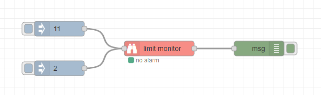

# node-red-contrib-limit-monitor

A limit monitor for Node-RED. An upper limit or a lower limit can be monitored. The alarm triggering can be delayed and the leaving of the alarm state can be controlled by a hysteresis.

## Installation

Open Node-RED and select `Manage palette` from the menu to open the Palette Manager. Go to the `Install` tab, search for `node-red-contrib-limit-monitor` and click `install`.

Alternatively, you can run the following command in your Node-RED user directory (typically `~/.node-red`):

```
npm i node-red-contrib-limit-monitor
```

## Example



```
[{"id":"96135b2b.aa4598","type":"tab","label":"Flow 1","disabled":false,"info":""},{"id":"a49408ec.a749a8","type":"limit-monitor","z":"96135b2b.aa4598","name":"","topic":"","limit":"5","kind":"2","delay":"1","hysteresis":"1","x":590,"y":300,"wires":[["e4702ec6.cd901"]]},{"id":"e4702ec6.cd901","type":"debug","z":"96135b2b.aa4598","name":"","active":true,"tosidebar":true,"console":false,"tostatus":false,"complete":"true","targetType":"full","statusVal":"","statusType":"auto","x":790,"y":300,"wires":[]},{"id":"7b2d0e21.8e7ef","type":"inject","z":"96135b2b.aa4598","name":"","props":[{"p":"payload"}],"repeat":"","crontab":"","once":false,"onceDelay":0.1,"topic":"","payload":"11","payloadType":"num","x":390,"y":260,"wires":[["a49408ec.a749a8"]]},{"id":"20794a97.2f3ae6","type":"inject","z":"96135b2b.aa4598","name":"","props":[{"p":"payload"}],"repeat":"","crontab":"","once":false,"onceDelay":0.1,"topic":"","payload":"2","payloadType":"num","x":390,"y":340,"wires":[["a49408ec.a749a8"]]}]
```

## License

[MIT](LICENSE)